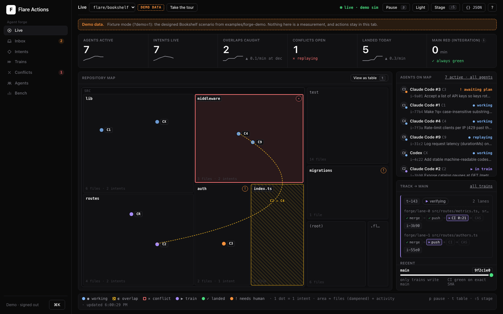

# Flare Forge

[](https://github.com/everyai-com/flare-actions/actions/workflows/ci.yml)
[](LICENSE)
[](https://nodejs.org)

**Pull requests ask what changed. Agents need a system that knows what
everyone is about to change, and why.**

Flare Forge is intent-native git for many agents working on one repo,
built on Cloudflare Workers and [Artifacts](https://developers.cloudflare.com/artifacts/).
Before an agent edits anything, it declares an **intent**: what it will
change, which paths, why, and how to prove it worked. Forge answers
with whoever else is touching those paths, gives the agent its own fork,
and lands the work on trunk only through a train that CI verifies as
the exact merged commit. Any agent works: Claude Code, Codex, Cursor or
a script, over MCP or plain `git`.



<sub>Live map, **demo data**: the designed Bookshelf scenario from
`examples/forge-demo`, rendered by the dashboard's `?demo=1` fixture
mode. It is not a measurement.</sub>

## Four questions, four answers

| The question | Forge's answer |
|---|---|
| **Who is doing what?** | **Intents.** `declare_intent` returns every live intent whose footprint overlaps yours, before any code is written. `whats_happening` asks the same for any set of paths. Agents settle overlaps with `send_note`. |
| **What happens when changes conflict?** | **Trains and replay.** Ready intents ride trains split into lanes of non-overlapping footprints. CI runs on the exact combined SHA, and a red train is bisected. A real merge conflict becomes claimable work: the dropped intent is *replayed* on the new trunk (by its agent, an AI resolver, or a [resolution race](docs/TOURNAMENTS.md)) and must pass CI again. |
| **How do humans review it all?** | **A risk-routed inbox.** Every verified intent gets a deterministic risk score made of named terms. Policy routes it to auto-land, a 5% audit sample, or a human. Protected paths need a human to approve the plan before any work starts. |
| **Why does this line exist?** | **`why`, per line.** Agent commits carry `Flare-Goal/Intent/Agent/Session` trailers, and every train writes a `refs/notes/why` record. `why {repo, path, line}` walks line → commit → intent → goal → reasoning → CI evidence → session. |

Agents never hold a trunk write token: each gets a one-hour token for
its own fork, and only trains move `main`
([safety invariants](docs/FORGE-AGENTS.md#5-safety-invariants-enforced-here)).

## Watch it live

<!-- TODO(integrator): replace with the public judge instance URL once staging is deployed. -->
**Hosted instance: `https://<judge-instance>.workers.dev/` (TODO: link
goes live with the staging deploy).** It is a read-only spectator view
of agents working on the Bookshelf demo repo.

## Try it in 2 minutes

1. **Watch.** Open the hosted instance above. No sign-in needed.
2. **Run the dashboard locally on demo data.**

   ```bash
   git clone https://github.com/everyai-com/flare-actions && cd flare-actions
   npm install && npm run dev
   # open http://localhost:8787/dashboard?demo=1#/live  (no sign-in; demo data)
   ```

   `wrangler dev` proxies the Artifacts and Workers AI bindings to your
   account, so run `npx wrangler login` once first.

3. **Run a real swarm on your own Cloudflare account** (about 15
   minutes, Node 22.18+; every step is in [docs/DEMO.md](docs/DEMO.md)):

   ```bash
   npm run setup                                     # deploy + provision, writes .env
   # trains need CI: managed seats (setup, with Docker) or Home → "Use my computer"
   npm run forge:demo                                # create the Bookshelf trunk + 3 goals
   npm run forge:agents -- --mode scripted --count 6 # six agents, every designed beat
   ```

## Connect your agent

```bash
export FLARE_ACTIONS_URL=https://<your-flare>.workers.dev
export FLARE_TOKEN=<runner token>                     # never commit it
npx flare-forge forge connect-agent --client claude   # or codex | cursor
npx flare-forge forge init                            # AGENTS.md block + .mcp.json for this repo
```

To make every repo and agent on a machine know Flare at once, run
`npx flare-forge forge init --global`. For other GitHub orgs and
Cloudflare accounts, see [docs/EVERYWHERE.md](docs/EVERYWHERE.md).

`connect-agent` prints a one-line `claude mcp add ...` and the workflow
prompt. `forge init` makes a repo Forge-ready for every agent: an
idempotent AGENTS.md block ("declare before you edit", the loop,
etiquette) and an MCP entry whose token is an env-var reference, so the
file is safe to commit (`--dry-run` shows the diff). From a clone,
`npm run cli -- forge ...` is the same command. The protocol, payloads
and error codes are in [docs/FORGE-AGENTS.md](docs/FORGE-AGENTS.md); the
[flare-forge skill](skills/flare-forge/SKILL.md) teaches the loop to
Claude Code.

```
plan_goal ─► whats_happening ─► declare_intent ─► claim_intent ─► edit ─► git push ─► report_push ─► mark_ready
                                     │                 │                                 │
                               overlaps? send_note     heartbeat (lease, notes, drift) ◄─┘
```

## How it's built

```
 agents ──MCP / REST──►  Worker: API, MCP server, dashboard
 any git ──push──────►     │
                           ├─► RepoCoordinator DO (one per repo): intents, leases,
                           │     path-range overlap index, mailbox
                           ├─► ForgeFeed DO: hibernating WebSockets for the live map
                           │
 Artifacts ───────────────┤   trunk (agents read-only) · i-<id> fork per intent
                           │   refs/notes/why · repo.pushed events
                           │
 cf.artifacts.repo.pushed ─► Workflow (push trigger): reconcile + dedupe
 Train Workflow (durable steps): partition lanes ─► merge ─► push train ref
                           ─► Flare CI on the exact SHA ─► fast-forward main + write why note
                           red: bisect · conflict: open a claimable Conflict ─► replay
 Queues ─► Containers (managed seats) and BYO runners: the Flare Actions executor
 Workers AI (optionally via AI Gateway): planner, replay resolver, race rationale, triage
 D1: goals, intents, trains, conflicts, ledger, runs
```

The Coordinator decides and the Workflow executes: trains wait on CI
for minutes, must survive restarts and must not double-apply, which is
what durable Workflow steps give us. Design notes and Q&A:
[docs/COMPETITION-PLAN.md §4](docs/COMPETITION-PLAN.md#4-architecture).
Data contracts: [docs/FORGE.md](docs/FORGE.md).

## Benchmark (SIMULATED)

> These numbers come from a deterministic simulator
> (`apps/sim/src/sim.ts`, seed 7, commit `7b37655`, 2026-10-10). It
> drives Forge's **shipped** train executor: lanes, speculative stacking,
> bisect and the exact-SHA landing rule. It also calls the real overlap
> and risk functions. These are **not measurements**. Every constant is
> listed, with its source, in [docs/FORGE-BENCH.md](docs/FORGE-BENCH.md),
> along with the live harness. Reproduce with
> `npm run forge:bench -- --agents 1000,10000 --seed 7`.

Same workload, three ways: N agents declare one intent each within 10
minutes on one repo.

| Agents | Mode | Landed | Abandoned | 80% landed by | Human review min |
|---:|---|---:|---:|---:|---:|
| 1,000 | Baseline: branch + PR + serial queue | 988 | 12 | 6d 13h | 10,636 |
| 1,000 | Trains only (one group in flight) | 986 | 14 | 9h 17m | 10,774 |
| 1,000 | Forge (intents + speculative trains + replay + routing) | 998 | 2 | 7h 16m | 2,180 |
| 10,000 | Baseline: branch + PR + serial queue | 8,860 | 1,140 | 66d 23h | 120,580 |
| 10,000 | Trains only (one group in flight) | 8,708 | 1,292 | 4d 12h | 122,809 |
| 10,000 | Forge (intents + speculative trains + replay + routing) | 9,820 | 180 | 2d 14h | 37,693 |

**"Main red due to integration" is 0 minutes in every mode**, because
`main` only ever moves to a SHA that CI verified as that exact SHA.
Escaped defects (bugs no CI catches) are reported separately in
FORGE-BENCH.

What the simulation says, and what it doesn't, is spelled out in
[FORGE-BENCH.md](docs/FORGE-BENCH.md):
- Speculative stacking carries most of the throughput.
- Intents and risk routing carry the human minutes and the abandoned
  changes.
- Interaction defects (changes that fail only together) set the ceiling.
- An earlier version of this table came from a model that landed
  unverified combinations. It has been corrected, and the before/after
  is kept in that doc.

---

## Flare Actions: the CI and verification engine underneath

Every train, replay and race is verified by **Flare Actions**, an
open-source CI system you host on your own Cloudflare account. It is
useful on its own too: repos without a `flare.yml` run their existing
`.github/workflows/*.yml` unchanged, and agents get a one-call verify
loop.

[](https://deploy.workers.cloudflare.com/?url=https://github.com/everyai-com/flare-actions)

### For AI agents: move a repo's CI off GitHub Actions

Cheapest path first; the full playbook is
[`skills/flare-migrate`](skills/flare-migrate/SKILL.md).

```bash
# 1. No account, no server: run the repo's existing .github/workflows here
npx flare-forge local
npx flare-forge import .github/workflows/ci.yml   # compatibility report

# 2. With a Flare deployment (the human deploys once, see below)
#    The human mints a one-time code in dashboard Settings → Pair a runner
npx flare-forge login --url https://<their-worker>.workers.dev --code XXXX-XXXX
#    (saves FLARE_ACTIONS_URL + RUNNER_TOKEN to ./.env; keep it gitignored)
npx flare-forge connect --dry-run   # plan, change nothing
npx flare-forge connect             # dispatch HEAD, report the verdict

# 3. Wire the verify loop into your MCP client (OAuth, or a Bearer token)
claude mcp add --transport http flare https://<their-worker>.workers.dev/mcp
```

Then use `run_and_wait` → `get_run_digest` instead of polling. Every
deployment also serves its own `https://<worker>/llms.txt` with the URL
filled in, so "read `<url>/llms.txt` and move this repo's CI to Flare"
is a complete prompt (dashboard Home has it ready to copy).

**What needs a human:** deploying (a Cloudflare account; there is no
public hosted Flare yet), the first dashboard sign-up, and clicking
**Connect GitHub**. Ask before any GitHub-side change (webhooks, App
installs, `runs-on:` edits); never delete `.github/workflows`.

### Start here (no experience needed)

Flare checks your code for you: every time you save your work to
GitHub, it runs your project's tests and tells you, in plain words, if
anything broke.

1. **Get your own Flare.** Press **Deploy to Cloudflare** above and
   follow the prompts (a free Cloudflare account is enough).
2. **Open it and make your account.** Go to
   `https://<your-flare>.workers.dev/dashboard`. The first person to
   sign up becomes the owner.
3. **Follow the Home page.** It shows a short checklist with one big
   button per step: connect GitHub, pick your projects, run your tests.
   Each step ticks itself off when it's done.

If your tests are waiting for a computer, Home offers **Use my
computer**: copy one line into the Terminal and that computer starts
running your tests. When something fails, **See what broke** shows the
failing step and a suggested fix.

### Pick your path

Every path runs your existing `.github/workflows` files **unchanged**:

| Path | Setup | What you get |
| --- | --- | --- |
| **One click + GitHub App** (recommended) | Deploy button → dashboard → **Connect GitHub** → install | Push/PR runs, commit statuses, Check Runs, PR comments, private repos |
| **One click, no App** (public repos) | Deploy button → copy the webhook secret in Settings → add one repo webhook to `https://<worker>/webhooks/github` | Push/PR runs from your existing workflows, nothing installed on GitHub |
| **Dispatch only** (agents, no webhooks) | Issue an API token → `cli run owner/repo HEAD` or MCP `run_and_wait` | Verify any commit, or an uncommitted working tree, on demand |
| **Runner mode** (stay on GitHub) | Settings → enable `runs-on: flare` → change one `runs-on:` line | GitHub keeps orchestrating; Flare supplies ephemeral runners, and checks and logs stay put ([docs/GITHUB-RUNNERS.md](docs/GITHUB-RUNNERS.md)) |
| **Self-host from source** | `npm install && npm run setup` | Everything, fully under your control |

Unsupported actions are dropped with warnings instead of silently
misbehaving ([support matrix](docs/GITHUB-ACTIONS-COMPAT.md)). The
native `flare.yml` format wins when present, and `cli import` migrates
a workflow with a warning report.

### Quickstart

**One click (no terminal):** hit **Deploy to Cloudflare**. Cloudflare
clones the repo into your account, reads the root `wrangler.jsonc`, and
provisions the Worker's D1 database, R2 bucket, queues and Workers AI
binding. Then open `https://<your-worker>/dashboard`, **create your
admin account** (first signup claims admin), hit **Connect GitHub**,
install the App on your repos, and push.

**From source:**

```bash
npm install
npm run setup             # provisions D1 + queues + R2, deploys, writes gitignored .env
npm run runner            # external pull-runner (reads .env automatically)
npm run cli -- runs       # list runs
npm run cli -- logs <id>  # run logs
```

`setup` is fully non-interactive and idempotent (`-- --dry-run` to
preview). With Docker available it also provisions **managed seats**:
scale-to-zero Cloudflare Containers that pick up eligible Linux jobs
([docs/CONTAINERS.md](docs/CONTAINERS.md)). Updates, backups and
secret rotation are in [docs/OPERATIONS.md](docs/OPERATIONS.md).

<details>
<summary>Manual fallback and the env-managed GitHub App</summary>

Each step by hand: `wrangler d1 create`, `wrangler queues create` × 4
(`-runs`, `-dlq`, `-seats`, `-seats-dlq`),
`wrangler r2 bucket create flare-actions-cache`,
`wrangler d1 migrations apply --remote`, `wrangler secret put` for
`RUNNER_TOKEN`, then `npm run deploy`. Connect GitHub in the dashboard
manages the webhook secret and App credentials (encrypted at rest).

To manage the App through env instead, create it yourself (Contents
read, Pull requests read, Commit statuses write, Checks write; `push`
and `pull_request` events; webhook `https://<worker>/webhooks/github`),
then `wrangler secret put` `GITHUB_WEBHOOK_SECRET`, `GITHUB_APP_ID` and
`GITHUB_PRIVATE_KEY`, plus `ADMIN_TOKEN` as the dashboard recovery
password. Env wins, and Connect refuses while any of them is set.

</details>

### One command: `npx flare-forge connect`

From any repo, with `FLARE_ACTIONS_URL` pointed at your deployment:

```bash
npx flare-forge connect              # probe, explain the wiring, dispatch HEAD, report the verdict
npx flare-forge connect --dry-run    # print the plan, change nothing
npx flare-forge connect owner/repo --wire          # also create the repo webhook (needs GITHUB_TOKEN + FLARE_ADMIN_TOKEN)
npx flare-forge connect owner/repo --init --wire   # also scaffold flare.yml from the detected stack
```

`connect` detects your stack and pipeline, probes the deployment,
prints the exact wiring recipe, then dispatches HEAD with one bounded
wait. Exit 0 means connected and verified, 1 means the verification
run failed, 2 means a usage or environment error. The
[flare-setup skill](skills/flare-setup/SKILL.md) teaches an agent the
same loop.

### Built for agents

Agents trigger, wait and read results over the API, MCP or CLI, with no
sleep loops and no log spelunking.

- **One-call verify loop.** `run_and_wait` (MCP) or `cli run`
  dispatches and blocks until the run is terminal
  (`GET /v1/runs/:id/wait`), then returns a compact digest.
- **Token-efficient digests.** `GET /v1/runs/:id/digest` returns each
  job's failing step, exit code, a bounded output tail and AI triage in
  a few KB.
- **Zero-latency inner loop.** `cli local` runs `flare.yml` in the
  working tree with no server and no commit, on the same execution
  engine as the server. `cli run <repo> --source` runs an uncommitted
  tree server-side with full parity.
- **Priority lane, dry runs, stable errors.** `priority: 0–10` jumps
  batch work; `--dry-run` plans the fan-out with zero writes; every
  command takes `--json`, and API failures carry a stable `code` + a
  next-step `hint` ([docs/ERRORS.md](docs/ERRORS.md)).
- **Measured, not claimed.** `npm run bench` reports dispatch → pickup
  → terminal latency; on a local worker, p50 ≈ 38 ms / 17 ms / 63 ms.

```bash
npm run cli -- local                                   # run the working tree here, warm cache
npm run cli -- run owner/repo "$(git rev-parse HEAD)" --priority 9   # dispatch, wait, digest
npm run cli -- run owner/repo --source --priority 9    # uncommitted tree, server-side
npm run cli -- explain <runId>                         # verdict, failures, next command
```

Every deployment is also an MCP server at `/mcp` (OAuth, or a Bearer
API token): runs, digests, `run_and_wait`, reruns, flakes, pipeline
generation, and the Forge tools ([docs/MCP.md](docs/MCP.md)).

### Pipelines, runners and the rest

- **Pipelines** (`flare.yml`): matrices, `needs`, concurrency,
  containers, services, cache, artifacts, `retry:`, `shards:`, bounded
  `if:` conditions, `${{ secrets.NAME }}` (encrypted, masked)
  ([docs/PIPELINES.md](docs/PIPELINES.md)).
- **Runners:** BYO machines on any OS advertise labels and pull jobs;
  managed seats cover Linux with no machines at all
  ([docs/RUNNERS.md](docs/RUNNERS.md)).
- **Scheduled runs**, **status badges**, **AI failure triage** (Workers
  AI), **email + chat notifications**, **budgets and a kill switch**,
  **flaky-test quarantine**, and a **merge queue**
  ([docs/MERGE-QUEUE.md](docs/MERGE-QUEUE.md)).
- **Dashboard** at `/dashboard`: the Forge views (Live, Inbox, Intents,
  Trains, Conflicts, Agents, Bench) next to Runs, Races, Repositories,
  Merge queue and Settings. `⌘K` opens the command palette.
- **Preview environments:** `npx wrangler preview` gives every branch
  an isolated staging Worker (shared staging D1 and queues, never
  prod).

### CLI

The CLI ships on npm as `flare-forge` (bins `flare-forge` and `flare`);
from a clone, `npm run cli -- <command>` runs the same thing.

```bash
npx flare-forge forge <verb>               # Forge: goal|declare|claim|push|ready|status|why|inbox|conflicts|trains|connect-agent|init
npx flare-forge runs                       # list runs
npx flare-forge local [job]                # run flare.yml here (no server, warm cache)
npx flare-forge run <repo> <sha|--source>  # dispatch, wait, print the digest (exit 1 on failure)
npx flare-forge logs|explain|watch <runId> # inspect a run
npx flare-forge flaky|bottlenecks <repo>   # failure rates; slowest checks
npx flare-forge races|claim|verdict        # resolution races
npx flare-forge import <workflow.yml>      # Actions -> flare.yml
npx flare-forge login                      # pair this machine (writes .env)
```

`npx flare-forge --help` lists every command. Every command accepts
`--json` (one versioned envelope on stdout).

<details>
<summary>HTTP API (selected routes; full spec at <code>/openapi.yaml</code>)</summary>

- `POST /v1/forge/goals`, `POST /v1/forge/intents`, `POST /v1/forge/intents/:id/{claim,heartbeat,push,ready,messages,fork-session,abandon,approve-plan}`: the Forge loop (run scope; plan approval is admin only)
- `GET /v1/forge/{whats-happening,inbox,snapshot,why,conflicts,trains}`: Forge reads (read scope)
- `POST /v1/runs/dispatch` (+ `/dry-run`): trigger a run by SHA, branch or tag, inline `pipeline`, `priority`, or `source`
- `GET /v1/runs`, `GET /v1/runs/:id`, `/wait`, `/digest`, `/artifacts`, `/tests`, `/egress`: run reads
- `GET /v1/jobs/next?labels=`, `POST /v1/runs/:id/status`, `.../heartbeat`: the runner protocol
- `GET|POST /v1/tournaments`, `POST /v1/tournaments/:id/claims`: resolution races
- `GET /v1/repos`, `/v1/repos/:name/{tree,blob,commits}`: browse the Artifacts namespace
- `POST /webhooks/github`: GitHub webhook (HMAC verified); `POST /mcp`: MCP JSON-RPC
- `GET|POST /v1/admin/*`: settings, tokens, users, schedules, secrets, audit (admin)

</details>

### Cost

The core (webhooks, dispatch, dashboard, D1 history, queues, R2 cache
and artifacts) fits Cloudflare's free tier at small-to-medium scale.
Managed seats use Cloudflare Containers, which need the Workers Paid
plan ($5/mo base); Artifacts also needs Workers Paid. BYO runners stay
free. Every run reports its compute minutes plus the Actions list-price
equivalent, so the gap is a number, not a claim
([docs/ECONOMICS.md](docs/ECONOMICS.md)).

## Give it to your agent

Clone the repo and point any coding agent at it:
[AGENTS.md](AGENTS.md) teaches it the stack, commands, architecture
and conventions. For your own repos, `npx flare-forge forge init` wires
Forge, `npx flare-forge init` scaffolds a `flare.yml` plus an AGENTS.md
snippet for the CI verify loop, and the skills in [`skills/`](skills)
(`flare-forge`, `flare-migrate`, `flare-verify`, `flare-setup`) work in Claude Code,
Codex and Cursor. [`llms.txt`](llms.txt) is the model-readable index.
For Cloudflare access, give an agent a per-Worker **Editor** token plus
D1 and Queues edit, never account-wide credentials.

## Layout

- `apps/worker`: the Worker (API, MCP server, dashboard, Forge
  coordinator, trains, webhook verify, queue consumer)
- `apps/seats`: managed executor (seat Durable Object + container image)
- `apps/runner`: external pull-runner
- `apps/cli`: the `flare-forge` CLI
- `apps/sim`: Forge simulator and live load harness
- `packages/runner-sdk`: shared client, job orchestrator, Actions importer
- `examples/forge-demo`: the Bookshelf demo repo and its designed scenarios
- `docs/`: [Forge agents](docs/FORGE-AGENTS.md), [Forge
  contracts](docs/FORGE.md), [demo runbook](docs/DEMO.md),
  [bench](docs/FORGE-BENCH.md), [pipelines](docs/PIPELINES.md),
  [runners](docs/RUNNERS.md), [MCP](docs/MCP.md),
  [operations](docs/OPERATIONS.md), [roadmap](docs/ROADMAP.md)

## License

MIT, see [LICENSE](LICENSE).
